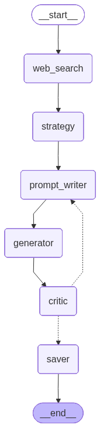

# Thumbnail Creator — LangGraph Reflexion Agent

A LangGraph agent that designs YouTube thumbnails through iterative self-criticism.  
Hand it a video topic → it searches the web → builds a visual strategy → generates an image → critiques it → loops until the score is good enough → saves the best result.

**Tech stack:** LangGraph 0.2+, LangChain OpenAI, `gpt-image-1` + GPT-4o vision, Tavily, Pydantic v2, python-dotenv, rich, Pillow

---

## How it works



### Node breakdown

| Node | What it does |
|------|-------------|
| `web_search` | Runs two Tavily searches (viral hooks + visual trends) and merges them into `search_summary`. Runs once before the loop. |
| `strategy` | `gpt-4o` with a structured JSON schema — produces a visual blueprint: archetype, dominant subject, brand elements, composition, text overlay, and what to avoid |
| `prompt_writer` | Translates the strategy JSON into a `gpt-image-1` prompt. On loop iterations, the full critique history is injected so every previous weakness is explicitly addressed |
| `generator` | Calls `gpt-image-1` (1536×1024, 16:9), saves `iter_N.png`, then composites real brand logos (Claude, OpenAI, Gemini, etc.) via PIL |
| `critic` | Vision LLM (`gpt-4o`) reads the PNG and returns a structured score (1–10) + critique via `with_structured_output(CritiqueOutput)`. Strict by design — most thumbnails score 5–7 so the loop actually fires |
| `should_continue` | Conditional edge — loops back to `prompt_writer` if score < target **and** iterations remain; otherwise routes to `saver` |
| `saver` | Picks the highest-rated image from `history`, copies it as `final.png`, writes `report.md` with a full iteration table and per-iteration details |

### Reflexion loop

```
START → web_search → strategy ──────────────────────────────── (runs once)
                                  │
                                  ▼
              ┌─────────────────────────────────────┐
              │  score < target AND iter < max_iter  │
              ▼                                      │
        prompt_writer → generator → critic ──────────┘
                                         └──► saver → END  (score OK or cap hit)
```

The loop is wired as a **conditional edge** (`add_conditional_edges`) from `critic` to `{prompt_writer, saver}`. The `history` field uses `Annotated[list, operator.add]` so every iteration's prompt + image path + score + critique accumulates instead of overwriting.

---

## Project structure

```
Thumbnail-Creator/
├── .env                          ← API keys (never committed)
├── .gitignore
├── pyproject.toml
├── README.md
├── assets/
│   └── logos/                    ← official brand PNGs composited after generation
│       ├── claude.png
│       ├── claude-code.png
│       ├── openai.png
│       ├── gemini.png
│       ├── copilot.png
│       └── perplexity.png
└── thumbnail_agent/
    ├── __init__.py               ← load_dotenv() so all submodules pick up API keys
    ├── state.py                  ← ThumbnailState TypedDict + history append reducer
    ├── prompts.py                ← STRATEGY_SYSTEM, PROMPT_WRITER_SYSTEM, CRITIC_SYSTEM
    ├── tools.py                  ← Tavily search wrapper
    ├── nodes.py                  ← 6 node functions + CritiqueOutput + should_continue
    ├── compositor.py             ← PIL logo compositing (bottom-right, stacked left)
    ├── graph.py                  ← build_graph() wires nodes + edges, returns compiled graph
    ├── main.py                   ← CLI entry point
    ├── make_diagram.py           ← writes graph.mmd + graph.png
    ├── graph.mmd                 ← Mermaid source with per-node colors
    ├── graph.png                 ← rendered architecture diagram
    └── outputs/                  ← (gitignored) timestamped run folders go here
        └── 20260524_113036_claude_code_replaced.../
            ├── iter_1.png
            ├── iter_2.png
            ├── iter_3.png
            ├── final.png
            └── report.md
```

---

## Thumbnails generated by this agent


_Each frame shows one iteration — tracks the agent's progression as the system prompts were refined, the critic scoring was tightened, and the PIL compositor was introduced to overlay accurate brand logos._

---

## Architecture decisions

| Decision | Reason |
|----------|--------|
| Added `strategy` as a 6th node (spec had 5) | The original spec went straight from `web_search` to `prompt_writer`. We separated strategy out because a good thumbnail requires a deliberate visual plan — archetype, emotion, composition, conflict — before writing the image prompt. Merging both responsibilities into `prompt_writer` produced generic results. |
| 10 thumbnail archetypes hardcoded into the strategy prompt | After researching high-CTR YouTube thumbnails, we identified 10 recurring visual patterns: `WARNING`, `VERSUS`, `EXPOSED`, `IMPOSSIBLE_RESULT`, `SECRET`, `REPLACEMENT`, `TRANSFORMATION`, `FAILURE`, `DOMINATION`, `MONEY`. Forcing the strategy to commit to one archetype eliminates vague compositions and gives the prompt writer a clear emotional frame to execute. |
| Two-query `web_search` (hooks + visual trends, not one query) | A single query returned either editorial copy or visual references — rarely both. Splitting into "viral hooks / most clicked" and "thumbnail visual trends" gives the strategy node distinct inputs for both the text angle and the visual execution. |
| `brand_elements` field as the strategy → compositor interface | We discovered early that `gpt-image-1` cannot reliably reproduce trademarked logos (Claude, OpenAI, Gemini, etc.). The strategy node outputs a `brand_elements` list of logo filenames; the generator calls `compositor.py` post-generation to overlay official PNGs from `assets/logos/` using PIL. This keeps brand marks pixel-perfect without polluting the image prompt. |
| Official Anthropic brand kit logos in `assets/logos/` | Rather than asking the model to "draw the Claude logo", we sourced the actual brand assets and composite them at a fixed size ratio (18% of thumbnail height) in the bottom-right corner, stacked left. This is the only reliable way to get accurate brand representation. |
| Critic uses 10 evaluation dimensions with automatic score caps | We found that a simple 1–10 prompt produced scores of 8–9 on iteration 1, killing the loop. The 10-dimension rubric (clarity, text impact, visual hook, color, psychological trigger, audience fit, scroll interruption, narrative, emotional intensity, brand recognition) with hard caps — e.g. "no recognizable brand when topic mentions Claude/OpenAI → max 6" — keeps first-pass scores in the 5–7 range so the loop actually runs. |
| `history: Annotated[list, operator.add]` | LangGraph's default state update would overwrite `history` on each iteration, losing earlier critiques. The append reducer accumulates every `{iteration, prompt, image_path, rating, critique}` entry, which the `saver` node uses to pick the best image and write the full report. |
| `with_structured_output(CritiqueOutput)` on the critic | Guarantees `rating` is always a typed `int`. The conditional edge function `should_continue` compares `state["rating"] >= state["target_rating"]` — if the critic returned a string or `None`, routing would silently break. |
| `graph.compile()` plain — no checkpointer | Checkpointers add complexity (SQLite/Redis setup, thread IDs) that this assignment does not require. Plain compile keeps the agent stateless and portable. |

---

## Setup

### 1. Prerequisites

- Python 3.11+
- [`uv`](https://docs.astral.sh/uv/) installed

### 2. Clone & create the virtual environment

```bash
git clone https://github.com/SQLicious/AgentBuilder_HW_Reflection-Agent-Thumbail-Generator.git
cd AgentBuilder_HW_Reflection-Agent-Thumbail-Generator

uv venv .venv --python 3.11
```

### 3. Install dependencies

```bash
# macOS / Linux
uv pip install -e . --python .venv/bin/python

# Windows PowerShell
uv pip install -e . --python .venv\Scripts\python.exe
```

### 4. Add your API keys

Create a `.env` file in the project root:

```env
OPENAI_API_KEY=sk-proj-...your-key...
TAVILY_API_KEY=tvly-...your-key...
```

> **OpenAI** — needs access to `gpt-4o` and `gpt-image-1`  
> **Tavily** — free tier is plenty (sign up at [tavily.com](https://tavily.com))

---

## Running the agent

Activate the venv first:

```bash
# Windows
.venv\Scripts\activate

# macOS / Linux
source .venv/bin/activate
```

### Basic run

```bash
python -m thumbnail_agent.main "Why Python is the best language for AI"
```

### Streaming mode (see each node update live)

```bash
python -m thumbnail_agent.main "Why Python is the best language for AI" --stream
```

### Custom thresholds

```bash
# stop at score 7, allow up to 4 iterations
python -m thumbnail_agent.main "10x Productivity with VS Code" --target-rating 7 --max-iterations 4
```

### Regenerate the graph diagram

```bash
python -m thumbnail_agent.make_diagram
# writes thumbnail_agent/graph.mmd and thumbnail_agent/graph.png
```

---

## Output

Each run creates a timestamped folder under `outputs/`:

```
outputs/20260524_113036_claude_code_replaced_my_engineering_team/
├── iter_1.png      ← first generated thumbnail (brand logos composited)
├── iter_2.png      ← second attempt (loop fired)
├── iter_3.png      ← third attempt
├── final.png       ← copy of the highest-rated image
└── report.md       ← full history: prompts, scores, critiques
```

### Sample `report.md` excerpt

```markdown
# Thumbnail Report: Claude Code replaced my engineering team

**Best score:** 8/10
**Total iterations:** 3

| Iter | Score | Critique |
|------|-------|----------|
| 1    | 7/10  | The connection to "Claude Code" is missing, limiting specific intrigue... |
| 2    | 6/10  | The Claude logo isn't evident, losing potential clicks from those... |
| 3    | 8/10  | Clarity & Impact: The focal subject is clear, with an intense emotional... |

### Iteration 1 — Score 7/10

**Prompt:** A shocked engineer with a large, exaggerated expression...
**Critique:** STRENGTHS: Expression is dramatic. CRITICAL ISSUES: No Claude branding...
```

---

## Environment variables reference

| Variable | Required | Description |
|----------|----------|-------------|
| `OPENAI_API_KEY` | Yes | OpenAI project API key (needs `gpt-4o` + `gpt-image-1`) |
| `TAVILY_API_KEY` | Yes | Tavily search API key |
